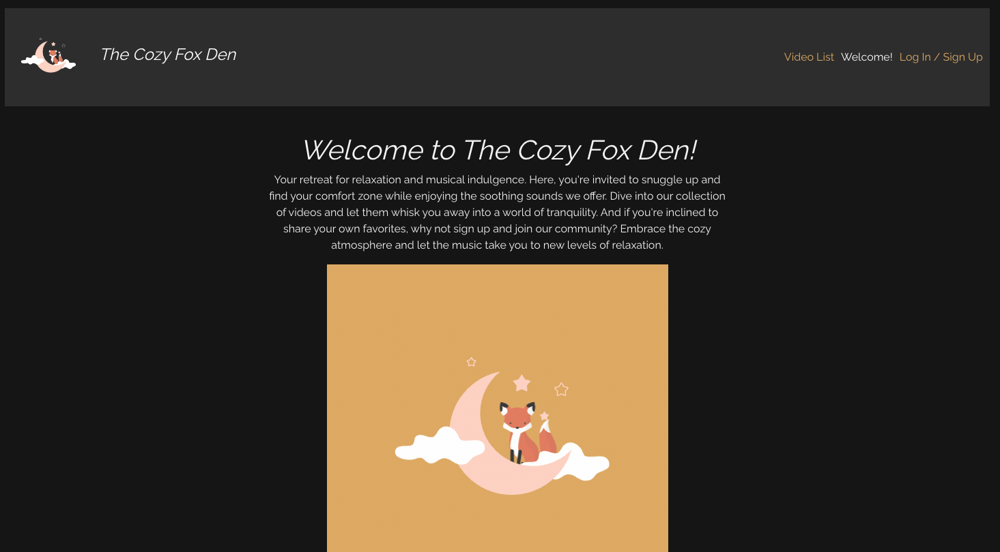
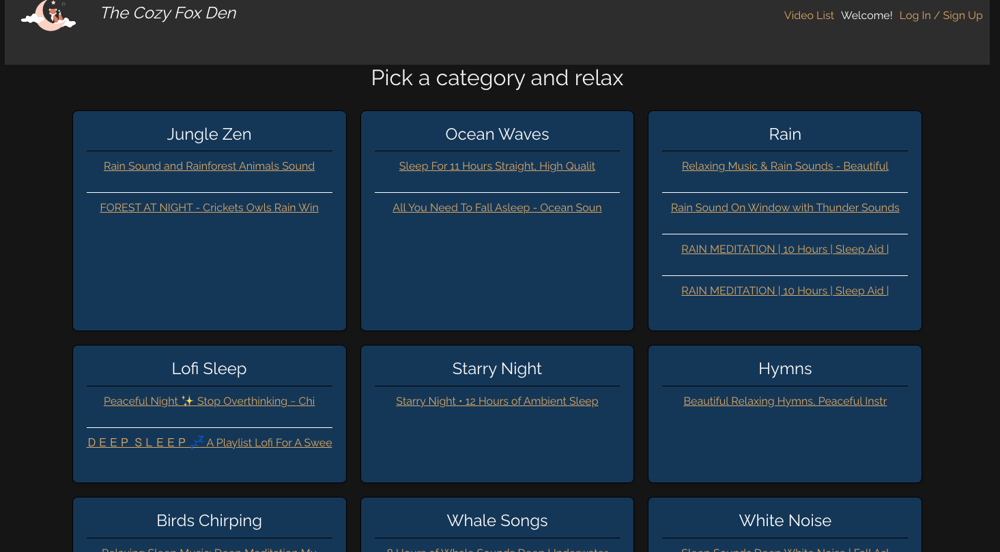
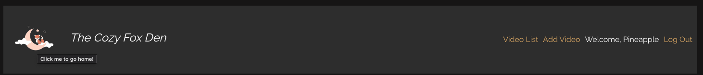
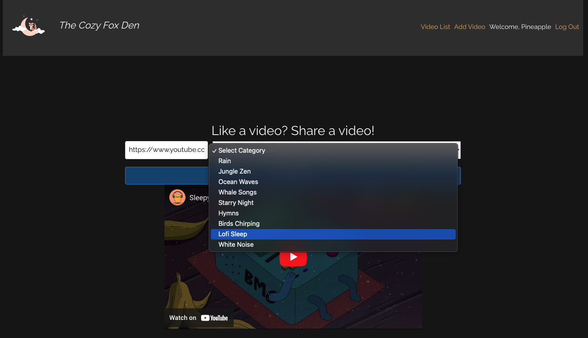
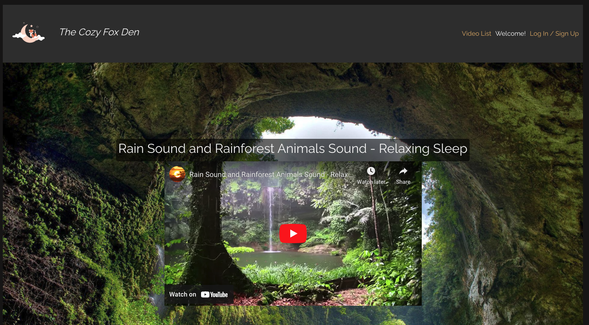

# The Cozy Fox Den

Your retreat for relaxation and musical indulgence. Here, you're invited to snuggle up and find your comfort zone while enjoying the soothing sounds we offer. Dive into our collection of videos and let them whisk you away into a world of tranquility. And if you're inclined to share your own favorites, why not sign up and join our community? Embrace the cozy atmosphere and let the music take you to new levels of relaxation.

---

## Link to App
[The Cozy Fox Den](https://thecozyfoxden-a2209a5d8c7d.herokuapp.com/)

---

## Home Page 


---

## Category Selection


---

## Logged in verification


---

## Adding a video


---

## Enjoy relaxation


---

## Code Preview
```js
  const handleNotify = async (e) => {
    e.preventDefault();
    const extractedVideoId = getVideoIdFromUrl(videoUrl);

    try {
      const response = await sendRequest('/api/videos', 'POST', {
        videoUrl: extractedVideoId,
        category: selectedCategory,
      });
      if (response.title !== 'Untitled Video') {
        const newVideo = response;

        const selectedCategoryObject = categories.find(cat => cat.id === selectedCategory);

        const formattedVideo = {
          ...newVideo,
          customCategory: selectedCategoryObject ? selectedCategoryObject.name : '',
        };
        setVideoUrl('');
        setSelectedCategory('');
        toast.success('Success! Video has been added!', {
          position: 'top-center',
          autoClose: 3000,
          theme: 'dark'
        })
      } else {
        const errorData = await response.json();
        toast.error(`Error: ${errorData.error}`);
      }
    } catch (error) {
      toast.error('An error occurred while adding the video', {
        position: 'top-center',
        autoClose: 3000,
        theme: 'dark'
      })
    }
  };

```
---
## Technologies Used
Front End:
 
 
 
 
 

Back End:
 
 
 

Deployment:
 

---
## Future Enhancements
   - [ ] Add a favorites list
   - [ ] Allow users to comment on the videos
   - [ ] Allow users to search the videos by name
   - [ ] Trello for more enhancements: [Trello](https://trello.com/b/qnQrYDDK/the-cozy-fox-den)
---